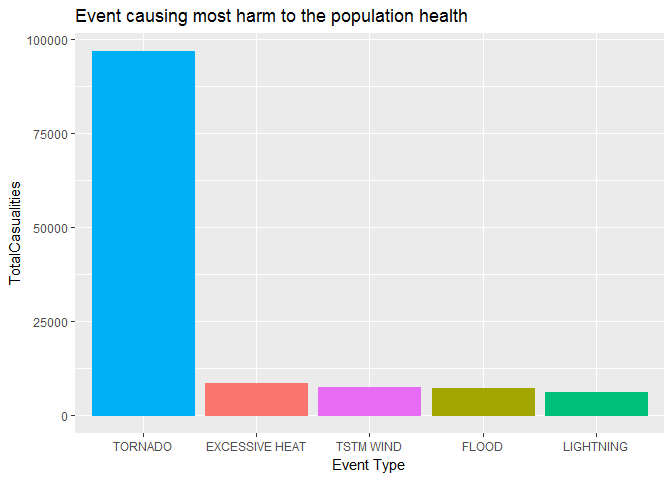
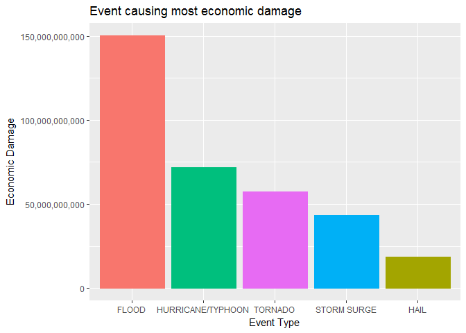

# Storm Data Analysis
Chandrasekar Ganesan  
March 11, 2017  


#Introduction

##Background
Storms and other severe weather events can cause both public health and economic problems for communities and municipalities. Many severe events can result in fatalities, injuries, and property damage, and preventing such outcomes to the extent possible is a key concern.

This project involves exploring the U.S. National Oceanic and Atmospheric Administration's (NOAA) storm database. This database tracks characteristics of major storms and weather events in the United States, including when and where they occur, as well as estimates of any fatalities, injuries, and property damage.

##Data References

The data for this assignment come in the form of a comma-separated-value file compressed via the bzip2 algorithm to reduce its size. You can download the file from the course web site:

* [Storm Data](https://d396qusza40orc.cloudfront.net/repdata%2Fdata%2FStormData.csv.bz2)

There is also some documentation of the database available. Here you will find how some of the variables are constructed/defined.

* National Weather Service [Storm Data Documentation](https://d396qusza40orc.cloudfront.net/repdata%2Fpeer2_doc%2Fpd01016005curr.pdf)
* National Climatic Data Center Storm Events [FAQ](https://d396qusza40orc.cloudfront.net/repdata%2Fpeer2_doc%2FNCDC%20Storm%20Events-FAQ%20Page.pdf)

The events in the database start in the year 1950 and end in November 2011. In the earlier years of the database there are generally fewer events recorded, most likely due to a lack of good records. More recent years should be considered more complete.

##Key Questions

* Across the United States, which types of events (as indicated in the EVTYPE variable) are most harmful with respect to population health?

* Across the United States, which types of events have the greatest economic consequences?

#Data Analysis 

## Get Data


```r
tf <- tempfile()
file_url <- "https://d396qusza40orc.cloudfront.net/repdata%2Fdata%2FStormData.csv.bz2"
download.file(file_url, destfile = tf)

stormdata <- read.csv(tf, stringsAsFactors = FALSE)
```

## Analyze Data


```r
head(stormdata)
```

```
##   STATE__           BGN_DATE BGN_TIME TIME_ZONE COUNTY COUNTYNAME STATE
## 1       1  4/18/1950 0:00:00     0130       CST     97     MOBILE    AL
## 2       1  4/18/1950 0:00:00     0145       CST      3    BALDWIN    AL
## 3       1  2/20/1951 0:00:00     1600       CST     57    FAYETTE    AL
## 4       1   6/8/1951 0:00:00     0900       CST     89    MADISON    AL
## 5       1 11/15/1951 0:00:00     1500       CST     43    CULLMAN    AL
## 6       1 11/15/1951 0:00:00     2000       CST     77 LAUDERDALE    AL
##    EVTYPE BGN_RANGE BGN_AZI BGN_LOCATI END_DATE END_TIME COUNTY_END
## 1 TORNADO         0                                               0
## 2 TORNADO         0                                               0
## 3 TORNADO         0                                               0
## 4 TORNADO         0                                               0
## 5 TORNADO         0                                               0
## 6 TORNADO         0                                               0
##   COUNTYENDN END_RANGE END_AZI END_LOCATI LENGTH WIDTH F MAG FATALITIES
## 1         NA         0                      14.0   100 3   0          0
## 2         NA         0                       2.0   150 2   0          0
## 3         NA         0                       0.1   123 2   0          0
## 4         NA         0                       0.0   100 2   0          0
## 5         NA         0                       0.0   150 2   0          0
## 6         NA         0                       1.5   177 2   0          0
##   INJURIES PROPDMG PROPDMGEXP CROPDMG CROPDMGEXP WFO STATEOFFIC ZONENAMES
## 1       15    25.0          K       0                                    
## 2        0     2.5          K       0                                    
## 3        2    25.0          K       0                                    
## 4        2     2.5          K       0                                    
## 5        2     2.5          K       0                                    
## 6        6     2.5          K       0                                    
##   LATITUDE LONGITUDE LATITUDE_E LONGITUDE_ REMARKS REFNUM
## 1     3040      8812       3051       8806              1
## 2     3042      8755          0          0              2
## 3     3340      8742          0          0              3
## 4     3458      8626          0          0              4
## 5     3412      8642          0          0              5
## 6     3450      8748          0          0              6
```

```r
summary(stormdata)
```

```
##     STATE__       BGN_DATE           BGN_TIME          TIME_ZONE        
##  Min.   : 1.0   Length:902297      Length:902297      Length:902297     
##  1st Qu.:19.0   Class :character   Class :character   Class :character  
##  Median :30.0   Mode  :character   Mode  :character   Mode  :character  
##  Mean   :31.2                                                           
##  3rd Qu.:45.0                                                           
##  Max.   :95.0                                                           
##                                                                         
##      COUNTY       COUNTYNAME           STATE              EVTYPE         
##  Min.   :  0.0   Length:902297      Length:902297      Length:902297     
##  1st Qu.: 31.0   Class :character   Class :character   Class :character  
##  Median : 75.0   Mode  :character   Mode  :character   Mode  :character  
##  Mean   :100.6                                                           
##  3rd Qu.:131.0                                                           
##  Max.   :873.0                                                           
##                                                                          
##    BGN_RANGE          BGN_AZI           BGN_LOCATI       
##  Min.   :   0.000   Length:902297      Length:902297     
##  1st Qu.:   0.000   Class :character   Class :character  
##  Median :   0.000   Mode  :character   Mode  :character  
##  Mean   :   1.484                                        
##  3rd Qu.:   1.000                                        
##  Max.   :3749.000                                        
##                                                          
##    END_DATE           END_TIME           COUNTY_END COUNTYENDN    
##  Length:902297      Length:902297      Min.   :0    Mode:logical  
##  Class :character   Class :character   1st Qu.:0    NA's:902297   
##  Mode  :character   Mode  :character   Median :0                  
##                                        Mean   :0                  
##                                        3rd Qu.:0                  
##                                        Max.   :0                  
##                                                                   
##    END_RANGE          END_AZI           END_LOCATI       
##  Min.   :  0.0000   Length:902297      Length:902297     
##  1st Qu.:  0.0000   Class :character   Class :character  
##  Median :  0.0000   Mode  :character   Mode  :character  
##  Mean   :  0.9862                                        
##  3rd Qu.:  0.0000                                        
##  Max.   :925.0000                                        
##                                                          
##      LENGTH              WIDTH                F               MAG         
##  Min.   :   0.0000   Min.   :   0.000   Min.   :0.0      Min.   :    0.0  
##  1st Qu.:   0.0000   1st Qu.:   0.000   1st Qu.:0.0      1st Qu.:    0.0  
##  Median :   0.0000   Median :   0.000   Median :1.0      Median :   50.0  
##  Mean   :   0.2301   Mean   :   7.503   Mean   :0.9      Mean   :   46.9  
##  3rd Qu.:   0.0000   3rd Qu.:   0.000   3rd Qu.:1.0      3rd Qu.:   75.0  
##  Max.   :2315.0000   Max.   :4400.000   Max.   :5.0      Max.   :22000.0  
##                                         NA's   :843563                    
##    FATALITIES          INJURIES            PROPDMG       
##  Min.   :  0.0000   Min.   :   0.0000   Min.   :   0.00  
##  1st Qu.:  0.0000   1st Qu.:   0.0000   1st Qu.:   0.00  
##  Median :  0.0000   Median :   0.0000   Median :   0.00  
##  Mean   :  0.0168   Mean   :   0.1557   Mean   :  12.06  
##  3rd Qu.:  0.0000   3rd Qu.:   0.0000   3rd Qu.:   0.50  
##  Max.   :583.0000   Max.   :1700.0000   Max.   :5000.00  
##                                                          
##   PROPDMGEXP           CROPDMG         CROPDMGEXP       
##  Length:902297      Min.   :  0.000   Length:902297     
##  Class :character   1st Qu.:  0.000   Class :character  
##  Mode  :character   Median :  0.000   Mode  :character  
##                     Mean   :  1.527                     
##                     3rd Qu.:  0.000                     
##                     Max.   :990.000                     
##                                                         
##      WFO             STATEOFFIC         ZONENAMES            LATITUDE   
##  Length:902297      Length:902297      Length:902297      Min.   :   0  
##  Class :character   Class :character   Class :character   1st Qu.:2802  
##  Mode  :character   Mode  :character   Mode  :character   Median :3540  
##                                                           Mean   :2875  
##                                                           3rd Qu.:4019  
##                                                           Max.   :9706  
##                                                           NA's   :47    
##    LONGITUDE        LATITUDE_E     LONGITUDE_       REMARKS         
##  Min.   :-14451   Min.   :   0   Min.   :-14455   Length:902297     
##  1st Qu.:  7247   1st Qu.:   0   1st Qu.:     0   Class :character  
##  Median :  8707   Median :   0   Median :     0   Mode  :character  
##  Mean   :  6940   Mean   :1452   Mean   :  3509                     
##  3rd Qu.:  9605   3rd Qu.:3549   3rd Qu.:  8735                     
##  Max.   : 17124   Max.   :9706   Max.   :106220                     
##                   NA's   :40                                        
##      REFNUM      
##  Min.   :     1  
##  1st Qu.:225575  
##  Median :451149  
##  Mean   :451149  
##  3rd Qu.:676723  
##  Max.   :902297  
## 
```

```r
# Read unique type of data
unique_eventtypes <- unique(stormdata$EVTYPE)

# Read the Injuries data
head(stormdata$INJURIES)
```

```
## [1] 15  0  2  2  2  6
```

```r
summary(stormdata$INJURIES)
```

```
##      Min.   1st Qu.    Median      Mean   3rd Qu.      Max. 
##    0.0000    0.0000    0.0000    0.1557    0.0000 1700.0000
```

```r
head(stormdata$FATALITIES)
```

```
## [1] 0 0 0 0 0 0
```

```r
summary(stormdata$FATALITIES)
```

```
##     Min.  1st Qu.   Median     Mean  3rd Qu.     Max. 
##   0.0000   0.0000   0.0000   0.0168   0.0000 583.0000
```

## Analysis

### Question 1: Which event is most harmful to population health?


```r
library(ggplot2)

casualities <- with(stormdata, aggregate(INJURIES + FATALITIES ~ EVTYPE, data=stormdata, FUN = "sum"))
names(casualities) <- c("EVTYPE","TotalCasualities")

#sort descending
casualities <- casualities[order(-casualities$TotalCasualities),]
top5 <- head(casualities, 5)

g <- ggplot(top5, aes(EVTYPE, TotalCasualities))
g <- g + geom_bar(stat = "identity", aes(colour=EVTYPE, fill=EVTYPE), show.legend = FALSE)
g <- g + scale_x_discrete(limits = top5$EVTYPE[order(-top5$TotalCasualities)])
g <- g + ggtitle("Event causing most harm to the population health")
g <- g + xlab("Event Type")
g + ylab("Total Casualities")
```

<!-- -->

> As it can be observed, the most harmful event is ** TORNADO **

### Question 2: Which event have the greatest economic consequences? 


```r
# Get the subset of strom data that deals with costs

stormsubset <- subset(stormdata, (stormdata$CROPDMGEXP == "M" | stormdata$CROPDMGEXP == "K" | stormdata$CROPDMGEXP == "B") | (stormdata$PROPDMGEXP =="M" | stormdata$PROPDMGEXP =="K" | stormdata$PROPDMGEXP =="B") )


# Factor the crop damage data based on codes

for(i in 1:length(stormsubset$CROPDMGEXP)) {
                ifelse(stormsubset$CROPDMGEXP[i] == "M", stormsubset$CROPDMG[i] <- stormsubset$CROPDMG[i] * 1000000, 
                ifelse(stormsubset$CROPDMGEXP[i] == "K", stormsubset$CROPDMG[i] <- stormsubset$CROPDMG[i] * 1000,
                ifelse(stormsubset$CROPDMGEXP[i] == "B", stormsubset$CROPDMG[i] <- stormsubset$CROPDMG[i] * 1000000000, stormsubset$CROPDMG[i] <- stormsubset$CROPDMG[i] * 1)))
}
summary(stormsubset$CROPDMGEXP)
```

```
##    Length     Class      Mode 
##    440355 character character
```

```r
# Factor the property damage data based on codes
for(i in 1:length(stormsubset$PROPDMGEXP)) {
                ifelse(stormsubset$PROPDMGEXP[i] == "M", stormsubset$PROPDMG[i] <- stormsubset$PROPDMG[i] * 1000000,
                ifelse(stormsubset$PROPDMGEXP[i] == "K", stormsubset$PROPDMG[i] <- stormsubset$PROPDMG[i] * 1000,
                ifelse(stormsubset$PROPDMGEXP[i] == "B", stormsubset$PROPDMG[i] <- stormsubset$PROPDMG[i] * 1000000000, stormsubset$PROPDMG[i] <- stormsubset$PROPDMG[i] * 1)))
}
summary(stormsubset$PROPDMGEXP)
```

```
##    Length     Class      Mode 
##    440355 character character
```


```r
library(ggplot2)
library(scales)

economic <- with(stormsubset, aggregate(CROPDMG + PROPDMG ~ EVTYPE, data=stormsubset, FUN=sum))
names(economic) <- c("Event.Type", "Economic.Damage")

top5_eco <- head(economic[order(-economic$Economic.Damage),], 5)
g
```

<!-- -->

```r
g <- ggplot(top5_eco, aes(Event.Type, Economic.Damage))
g <- g + geom_bar(stat = "identity", aes(colour=Event.Type, fill=Event.Type), show.legend = FALSE)
g <- g + scale_x_discrete(limits = top5_eco$Event.Type[order(-top5_eco$Economic.Damage)])
g <- g + ggtitle("Event causing most economic damage")
g <- g + xlab("Event Type")
g + ylab("Economic Damage") + scale_y_continuous(labels = comma)
```

<!-- -->

