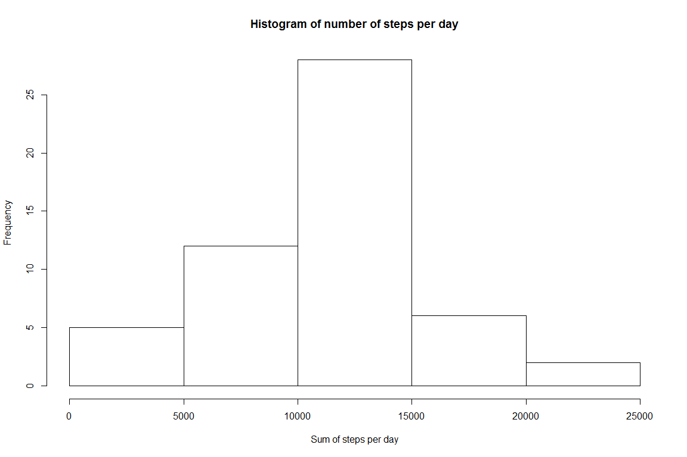
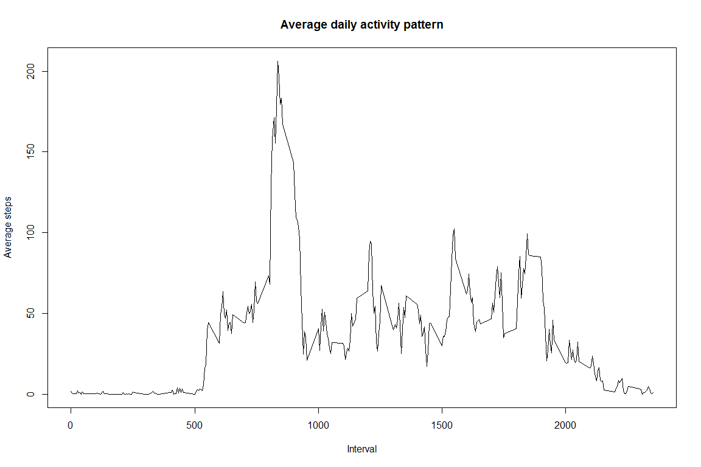
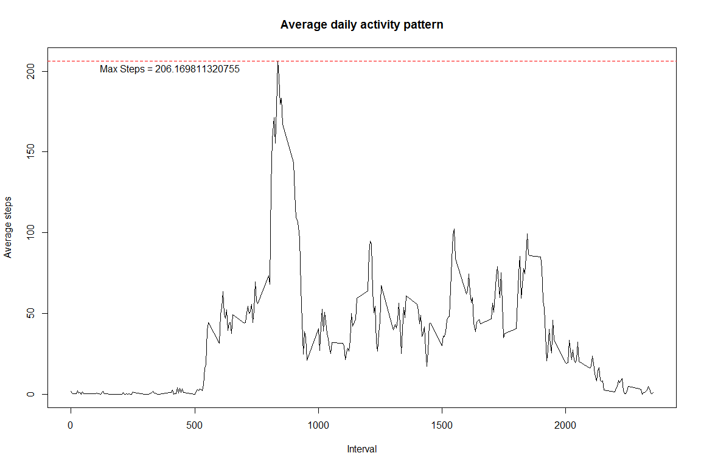
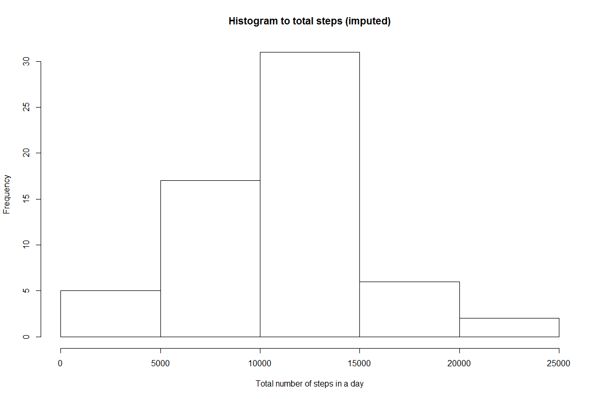
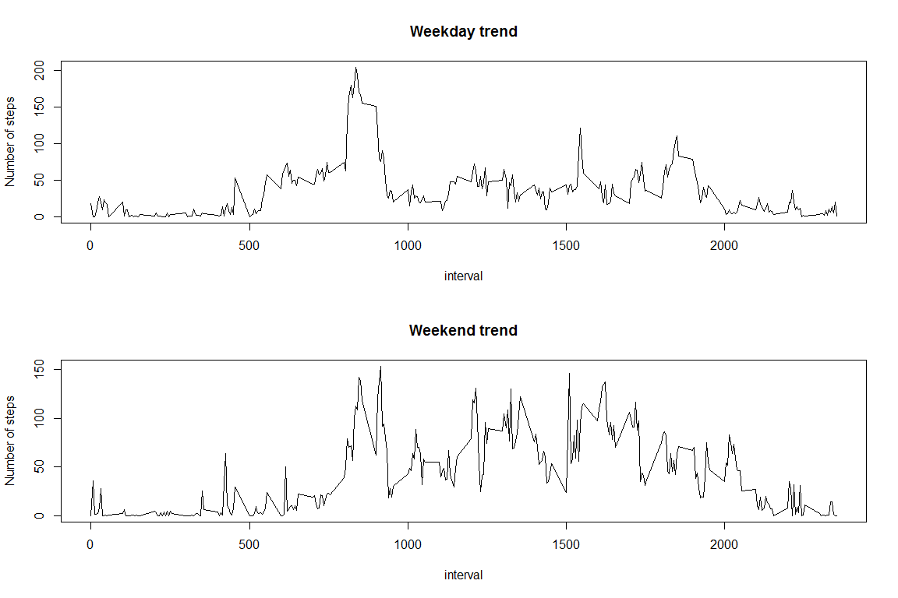

# Reproducible Research Assignment - Week 2
Chandrasekar Ganesan  
February 26, 2017  


## Getting and processing the data

>Let's first get the data


```r
library(dplyr)
library(graphics)

activitydata <- read.csv("activity.csv", header = TRUE, na.strings = "NA")

#Format the date column as date
activitydata$date <- as.POSIXct(activitydata$date)

isdatana <- is.na(activitydata$steps)

#Ignore the NA values
data <- activitydata[!isdatana,]
```

## Histogram of the total number of steps taken each day


```r
steps_per_day_group <- group_by(data, date)
steps_per_day <- summarize(steps_per_day_group,sumsteps=sum(steps))
hist(steps_per_day$sumsteps, xlab="Sum of steps per day", ylab = "Frequency", main="Histogram of number of steps per day")
```

<!-- -->

## Mean and Median steps taken each day

```r
summary(steps_per_day)
```

```
##       date                        sumsteps    
##  Min.   :2012-10-02 00:00:00   Min.   :   41  
##  1st Qu.:2012-10-16 00:00:00   1st Qu.: 8841  
##  Median :2012-10-29 00:00:00   Median :10765  
##  Mean   :2012-10-30 17:37:21   Mean   :10766  
##  3rd Qu.:2012-11-16 00:00:00   3rd Qu.:13294  
##  Max.   :2012-11-29 00:00:00   Max.   :21194
```

**Mean steps are 10766, Median steps are 10765**

## Average daily activity pattern


```r
steps_group <- aggregate(steps ~ interval, data, mean)

plot(steps_group$interval, steps_group$steps, type="l", xlab="Interval", ylab="Average steps", main="Average daily activity pattern")
```

<!-- -->


## The 5-minute interval that, on average, contains the maximum number of steps


```r
steps_group <- aggregate(steps ~ interval, data, mean)

plot(steps_group$interval, steps_group$steps, type="l", xlab="Interval", ylab="Average steps", main="Average daily activity pattern")

abline(h = max(steps_group$steps), lty=2, col='red')

text(y=max(steps_group$steps)-5,x=400,labels = paste("Max Steps =",max(steps_group$steps),sep=" "))
```

<!-- -->

## Imputing missing data

```r
library(mice)
#Impute the missing data using "mice" package
#Following function will use "Predictive Mean Matching" algorithm to impute NA()s.
myframe <- as.data.frame(activitydata)
myframe[,c("date")] <- as.factor(myframe[,c("date")])
tempdata <- mice(data = myframe, seed=500)
```

```
## 
##  iter imp variable
##   1   1  steps
##   1   2  steps
##   1   3  steps
##   1   4  steps
##   1   5  steps
##   2   1  steps
##   2   2  steps
##   2   3  steps
##   2   4  steps
##   2   5  steps
##   3   1  steps
##   3   2  steps
##   3   3  steps
##   3   4  steps
##   3   5  steps
##   4   1  steps
##   4   2  steps
##   4   3  steps
##   4   4  steps
##   4   5  steps
##   5   1  steps
##   5   2  steps
##   5   3  steps
##   5   4  steps
##   5   5  steps
```

```r
#combine the data back to one single set
cdata  <- complete(tempdata)

#we now have full data set with imputed missing values.
```

##Histogram of total number of steps per day

```r
sumdata <- aggregate(steps ~ date, cdata, sum)
hist(sumdata$steps, main="Histogram to total steps (imputed)", xlab="Total number of steps in a day")
```

<!-- -->

## Comparing activities by weekdays and weekends


```r
#Determine the weekday
cdata$weekday <- weekdays(as.Date(cdata$date))

#Tag the weekday type
if("weekdaytype" %in% colnames(cdata)) {
  cdata$weekdaytype <- as.character(cdata$weekdaytype)
}
cdata$weekdaytype[!(cdata$weekday %in% c("Saturday","Sunday"))] <- "Weekday"
cdata$weekdaytype[cdata$weekday %in% c("Saturday","Sunday")] <- "Weekend"

cdata$weekdaytype <- as.factor(cdata$weekdaytype)

# calculate average data

avgsteps <- aggregate(steps ~ interval + weekdaytype, cdata, mean)
#Split and plot two graphs
#library(ggplot2)
#qplot(x = interval, y = steps, data=avgsteps, geom = c("line"), facet_wrap(. ~ weekdaytype, ncol=2))
par(mfrow=c(2,1))
with(avgsteps[avgsteps$weekdaytype == "Weekday",], plot(interval, steps, type="l", ylab="Number of steps", main="Weekday trend"))

with(avgsteps[avgsteps$weekdaytype == "Weekend",], plot(interval, steps, type="l", ylab="Number of steps", main="Weekend trend"))
```

<!-- -->

